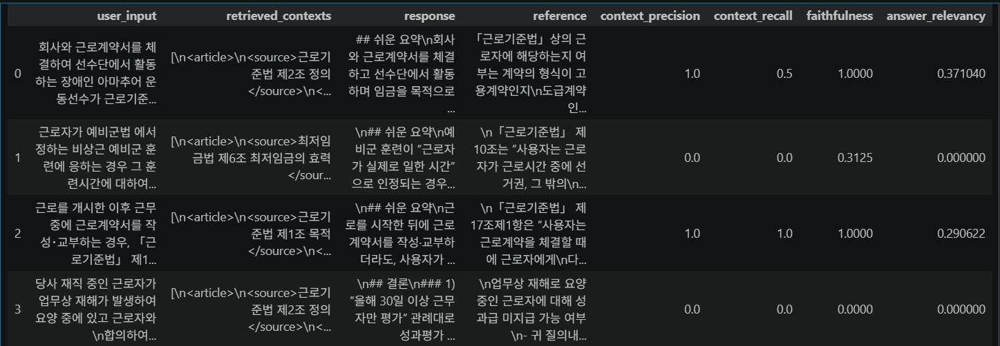
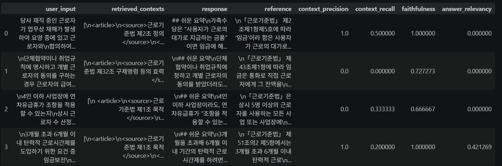
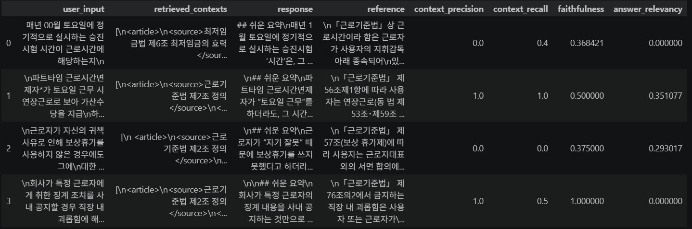
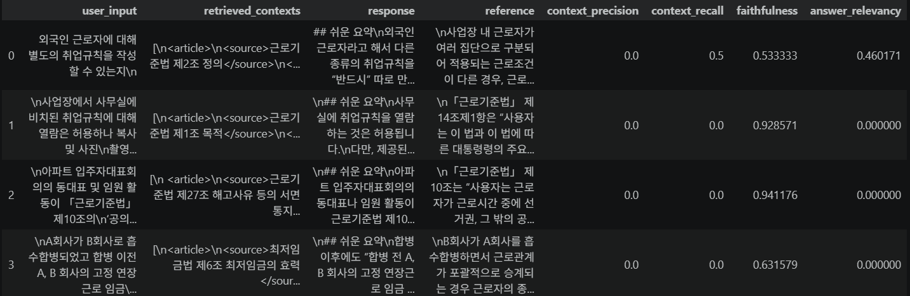

# 테스트 계획 및 결과 검증

## 1. 검증 시나리오 및 테스트 계획

### 1-1. 테스트 데이터셋 구축

본 프로젝트의 성능 검증을 위해 고용노동부 질의회시 데이터를 활용하였다.

질의회시는 실제 노동 현장에서 발생한 질문에 대해 행정기관이 관련 법령과 판례를 검토하여 공식적인 해석을 제공한 자료이다.

평가 데이터셋은 다음과 같이 구성하였다.

- **질의(Question)** → 사용자 입력(User Input)
- **회시(Answer)** → Ground Truth(정답 데이터)

즉, 실제 사용자가 노동 관련 문제를 질문하는 상황을 가정하고, 해당 질문에 대해 행정기관이 제시한 회시 내용을 정답으로 설정하였다.

질의회시를 테스트 데이터로 선정한 이유는 법률 도메인의 특수성 때문이다.

일반적인 자연어 처리 과제에서는 하나의 정답을 정의할 수 있지만, 법률 문제는 동일한 사실관계에 대해서도 다양한 표현과 해석이 가능하며, 판례에 따라 결론이 달라질 수 있다.

특히 본 프로젝트는 법령과 판례를 활용하여 답변을 생성하는 구조이기 때문에 특정 문장을 정답으로 지정하는 방식은 적절하지 않다고 판단하였다.

반면 질의회시는 실제 사례와 그에 대한 행정기관의 해석이 함께 정리되어 있으며, 질문과 답변이 명확하게 대응되어 있다는 장점이 있다.

따라서 질의회시의 질의 부분을 입력 데이터로, 회시 부분을 Ground Truth로 활용하여 평가를 진행하였다.

다만 회시 역시 특정 사실관계에 대한 행정해석이라는 점에서 절대적인 정답이라기보다 하나의 법적 판단에 가깝다. 따라서 본 평가에서는 회시와 문장이 얼마나 유사한가보다, 회시가 제시하는 법적 판단 방향을 얼마나 적절하게 재현하였는가를 중심으로 결과를 해석하였다.

---

### 1-2. 테스트 시나리오

평가 데이터셋은 노동법 주요 영역을 균형 있게 포함하면서도 단순 조문 검색만으로 답변하기 어려운 사례형 질의 중심으로 구성하였다.

| 구분 | 평가 시나리오 |
|------|--------------|
| 근로자성 판단 | 장애인 아마추어 운동선수의 근로자성 판단 |
| 근로시간 | 예비군 훈련시간의 유급 처리 여부 |
| 근로계약 | 근로 개시 후 근로계약서 작성·교부의 적법성 |
| 산업재해 | 요양 중 근로자의 성과평가·성과급 지급 및 해고 가능 여부 |
| 임금 | 가족수당의 임금 해당 여부 |
| 임금 | 가상자산(비트코인 등)을 이용한 임금 지급 가능 여부 |
| 휴가 | 4인 이하 사업장의 연차유급휴가 적용 여부 |
| 근로시간 | 3~6개월 탄력적 근로시간제 도입 요건 |
| 근로시간 | 승진시험 응시시간의 근로시간 해당 여부 |
| 근로시간 | 파트타임 근로시간면제자의 토요일 근무 수당 |
| 휴가 | 보상휴가 미사용 시 임금 지급 의무 |
| 직장 내 괴롭힘 | 징계 사실의 사내 공지가 직장 내 괴롭힘에 해당하는지 |
| 취업규칙 | 외국인 근로자 대상 별도 취업규칙 작성 가능 여부 |
| 취업규칙 | 취업규칙 열람은 허용하되 복사·촬영을 제한할 수 있는지 |
| 공의 직무 | 아파트 입주자대표회의 활동의 공의 직무 해당 여부 |
| 차별 처우 | 합병 이후 서로 다른 연장근로수당 기준 적용 가능 여부 |

위 시나리오는 근로자성, 임금, 근로시간, 산업재해, 취업규칙, 직장 내 괴롭힘 등 노동법의 주요 영역을 포함하도록 구성하였다.

또한 단순 법령 검색이 아닌 법령, 판례, 행정해석을 종합적으로 활용해야 답변할 수 있는 사례를 중심으로 선정하여 실제 법률 상담 환경과 유사한 조건에서 평가를 수행하였다.

---

## 2. 자연어 및 생성모델 평가 지표 활용

초기에는 BLEU, ROUGE와 같은 전통적인 자연어 생성 평가 지표 활용을 검토하였다.

그러나 법률 분야에서는 동일한 법적 판단을 다양한 표현으로 설명할 수 있으며, 표현이 달라도 법적 결론은 동일한 경우가 많다.

예를 들어,

> "근로기준법상 근로자에 해당한다."

와

> "사용자의 지휘·감독 아래 임금을 목적으로 근로를 제공하였다면 근로자로 인정될 가능성이 높다."

는 표현은 다르지만 실질적으로 동일한 판단을 의미한다.

따라서 단순 문자열 유사도를 측정하는 BLEU, ROUGE는 법률 도메인의 특성을 충분히 반영하지 못한다고 판단하였다.

이에 따라 본 프로젝트에서는 RAG 시스템 평가에 특화된 RAGAS(Retrieval-Augmented Generation Assessment)를 활용하였다.

RAGAS는 GPT 기반의 LLM-as-a-Judge 방식을 활용하여 검색 품질과 생성 품질을 함께 평가할 수 있으며, 단순 문장 유사성이 아니라 실제 검색된 근거를 기반으로 답변이 생성되었는지를 평가할 수 있다는 장점이 있다.

---

## 3. RAG 및 LLM-as-a-Judge 평가

본 프로젝트에서는 다음 네 가지 지표를 활용하였다.

### 3-1. Context Precision

검색된 문서가 질문과 얼마나 관련성이 높은지를 평가한다.

즉, 검색 결과 중 실제 답변에 도움이 되는 문서의 비율을 의미한다.

### 3-2. Context Recall

답변 생성에 필요한 근거 문서를 충분히 검색했는지를 평가한다.

즉, 필요한 법령과 판례가 검색 단계에서 누락되지 않았는지를 확인한다.

### 3-3. Faithfulness

생성된 답변이 검색된 문서를 근거로 작성되었는지를 평가한다.

높은 점수는 환각(Hallucination, 실제 근거 없이 내용을 생성하는 현상)이 적음을 의미한다.

### 3-4. Answer Relevancy

생성된 답변이 사용자의 질문 의도에 적절하게 응답하고 있는지를 평가한다.

---

## 4. 평가 결과 해석

RAGAS 평가 결과, Faithfulness는 비교적 높은 수준을 보였다.

이는 생성된 답변이 검색된 법령과 판례를 기반으로 작성되고 있음을 의미하며, 존재하지 않는 법령이나 판례를 임의로 생성하는 환각 현상은 비교적 적게 발생한 것으로 판단된다.

반면 Context Precision과 Context Recall은 질문 유형에 따라 편차가 존재하였다.

특히 근로자성 판단, 산업재해, 취업규칙 적용과 같이 복수의 법리와 판례가 함께 고려되어야 하는 문제에서는 필요한 근거를 충분히 검색하지 못하는 사례가 확인되었다.

다만 이러한 결과는 단순한 검색 성능의 문제만으로 해석하기 어렵다.

본 평가에서 Ground Truth로 사용한 회시는 특정 사실관계를 전제로 작성된 행정해석이다.

따라서 시스템이 회시와 다른 표현을 사용하거나, 회시에서 언급하지 않은 판례를 활용하여 동일한 결론에 도달한 경우에도 평가 점수가 낮아질 수 있다.

특히 Answer Relevancy는 이러한 영향을 크게 받을 수 있다.

법률 문제는 수학 문제처럼 하나의 정답이 존재하는 영역이 아니며, 동일한 결론에 도달하더라도 적용하는 법리나 설명 방식은 달라질 수 있기 때문이다.

따라서 본 프로젝트에서는 RAGAS 점수를 절대적인 성능 지표라기보다 Retrieval 구조 개선 전후를 비교하기 위한 상대적 지표로 활용하였다.

또한 평가 과정에서 Faithfulness는 높게 유지되었음에도 Context Recall이나 Answer Relevancy가 낮게 나타나는 사례가 존재하였다.

이는 생성 모델이 검색된 문서를 충실하게 활용하고 있음에도 Retrieval 단계에서 적절한 법령이나 판례를 확보하지 못하면 최종 답변 품질 역시 제한된다는 것을 의미한다.

결과적으로 법률 도메인에서는 생성 모델 자체보다 Retrieval 단계의 품질이 전체 시스템 성능에 더욱 큰 영향을 미친다는 사실을 확인할 수 있었다.

---

## 5. 평가를 통해 얻은 인사이트

프로젝트를 진행하면서 가장 크게 느낀 점은 법률 판단 과정을 단순한 벡터 검색(Vector Retrieval)만으로 대체하기 어렵다는 점이었다.

실제 법률가의 판단 과정은 일반적으로 다음과 같은 순서로 이루어진다.

1. 사용자의 사실관계를 파악한다.
2. 관련 법 조항을 검토한다.
3. 핵심 쟁점(Issue)을 도출한다.
4. 유사 판례를 검토한다.
5. 판례가 어떤 논리와 판단 기준으로 결론에 도달했는지 분석한다.
6. 해당 사례에 법리를 적용하여 결론을 도출한다.

현재 대부분의 RAG 시스템은 2번의 법령 검색 또는 4번의 판례 검색 단계에 초점을 맞추고 있다. 즉, 관련 문서를 얼마나 정확하게 찾아오는지에 집중하는 구조이다.

반면 실제 법률 판단에서 중요한 것은 단순히 법령이나 판례를 찾는 것이 아니라, 사용자의 사실관계로부터 적절한 쟁점을 도출하고 해당 쟁점에 맞는 법리를 적용하는 과정이다.

본 프로젝트는 이러한 한계를 보완하기 위해 단순 벡터 검색 기반 RAG를 그대로 사용하는 대신, 실제 법률가의 판단 과정 중 2번(관련 법 조항 검토), 3번(쟁점 도출), 4번(유사 판례 검토)에 해당하는 부분을 강화하는 방향으로 설계하였다.

이를 위해 SAC(Summary-Augmented Chunking) 구조를 도입하였다.

판례 전처리 과정에서는 LLM과 사전 정의된 노동법 카테고리를 활용하여 판례를 구조화하였다. 전처리 과정에서 다음 정보를 추출하였다.

- 핵심 쟁점
- 판결 결론
- 사건 개요
- 판결 요지
- 핵심 법리
- 참조 조문

특히 판례를 단순 전문 단위로 저장하지 않고, 근로자성, 임금, 근로시간, 산업재해 등 사전에 정의한 카테고리 기준으로 분류한 뒤 핵심 쟁점과 판결 결론을 요약하여 검색용 SAC를 구축하였다.

이를 통해 사용자의 질문이 특정 조문이나 판례 문구와 직접적으로 일치하지 않더라도, 동일한 법적 쟁점이나 카테고리에 속하는 판례를 검색할 수 있도록 설계하였다.

즉, 현재 시스템은 실제 법률가의 판단 과정 중 3번인 쟁점 도출 단계를 일정 부분 수행하고 있다. 사용자의 질문과 판례 전문을 단순 의미 유사도로 연결하는 것이 아니라, 전처리 단계에서 추출한 카테고리와 핵심 쟁점을 활용하여 보다 적절한 판례를 검색하도록 구성하였다.

이는 단순히 판례 전문을 임베딩하는 방식보다 한 단계 발전된 구조로, 판례에 포함된 법적 쟁점을 Retrieval 단계에서 활용할 수 있도록 설계한 것이다.

평가를 진행하면서 검색 정확도만 향상시킨다고 법률 판단 품질이 함께 향상되는 것은 아니라는 점도 확인할 수 있었다.

특히 법률 문제는 단순히 유사한 문서를 찾는 문제가 아니라, 사실관계로부터 어떤 법적 쟁점을 도출할 것인지가 핵심이라는 점을 확인하였다.

다만 현재 구조는 판례 전처리 단계에서 정의된 카테고리와 대표 쟁점을 활용하는 수준에 머물러 있다.

실제 법률 판단에서는 사용자의 사례로부터 직접 쟁점을 도출해야 하며, 하나의 사례에 복수의 쟁점이 동시에 존재하는 경우도 많다.

예를 들어,

> "월급을 받지 못한 상태에서 해고까지 당했다."

라는 사례는 임금체불과 부당해고라는 두 가지 쟁점을 동시에 포함할 수 있다.

현재 구조는 판례에 저장된 대표 쟁점을 중심으로 Retrieval이 수행되므로, 향후에는 사용자 입력 단계에서 다중 쟁점을 추출하는 구조가 필요하다고 판단하였다.

또한 법률 판단 과정에서 중요한 것은 단순히 어떤 조문을 찾았는지가 아니라, 해당 조문이 어떤 판단 기준에 의해 적용되었는지 이해하는 것이다.

예를 들어 근로자성 판단 판례는 단순히 "근로자에 해당한다"는 결론만 중요한 것이 아니라 다음과 같은 판단 요소가 함께 고려된다.

- 사용자의 지휘·감독 여부
- 근무시간 통제 여부
- 보수 지급 방식
- 독립 사업 가능성

현재 SAC는 핵심 법리 수준까지는 구조화되어 있으나, 실제 판결에서 활용된 판단 요소까지는 구조화하지 못하고 있다.

또한 현재 서비스는 실제 법률가의 판단 과정 중 2번(관련 법 조항 검토), 3번(쟁점 도출), 4번(유사 판례 검토)을 지원하는 수준에 가깝다. 다만 3번의 쟁점 도출은 사용자 입력으로부터 직접 수행하는 방식이 아니라, 판례를 카테고리와 핵심 쟁점 기준으로 전처리하여 Retrieval 단계에서 활용하는 방식으로 구현되어 있다.

반면 5번의 법리 분석과 6번의 사례 적용 및 결론 도출은 여전히 생성 모델의 일반적인 추론 능력에 상당 부분 의존하고 있다.

이는 향후 법률 AI가 단순 검색을 넘어 법리 적용 단계까지 발전하기 위해 해결해야 할 과제라고 판단하였다.

---

## 6. 피드백 및 개선 방향

### 6-1. 사용자 입력 기반 다중 쟁점 추출

현재는 판례 전처리 단계에서 생성된 대표 쟁점을 활용하고 있다.

그러나 실제 노동 분쟁은 하나의 쟁점만 포함하는 경우보다 여러 쟁점이 동시에 존재하는 경우가 많다.

따라서 향후에는 사용자 질문으로부터 직접 핵심 쟁점을 추출하고, 복수의 쟁점을 병렬적으로 검색하는 구조를 도입할 필요가 있다.

### 6-2. 판례 메타데이터 세분화

현재 SAC는 다음 정보를 중심으로 구성되어 있다.

- 핵심 쟁점
- 판결 결론
- 사건 개요
- 판결 요지
- 핵심 법리
- 참조 조문

그러나 실제 법률 판단은 결론 자체보다 결론에 도달한 판단 기준이 더욱 중요하다.

따라서 향후에는 판례 전문을 보다 세분화하여 다음과 같은 메타데이터를 추가적으로 구축할 필요가 있다.

- 사실관계(Facts)
- 판단 요소(Factors)
- 판단 기준(Criteria)
- 법리(Rule)
- 결론(Conclusion)

이를 통해 단순 유사도 검색이 아닌 판단 요소 기반 Retrieval이 가능해질 것으로 기대한다.

### 6-3. 법리 추론 단계 추가

현재 시스템은 구조적으로

> 검색 → 답변 생성

에 가까운 형태를 가진다.

반면 실제 법률가는

> 사실관계 파악 → 관련 법령 검토 → 쟁점 도출 → 관련 판례 검토 → 판단 요소 비교 → 법리 적용 → 결론 도출

과정을 거친다.

현재 서비스는 이 중 법령 검토, 쟁점 도출, 판례 검토 단계까지는 일정 수준 지원하고 있다. 특히 쟁점 도출의 경우 판례를 카테고리와 핵심 쟁점 기준으로 전처리하여 Retrieval에 활용함으로써 부분적으로 구현되어 있다.

그러나 판례의 판단 논리를 구조적으로 분석하고 사용자 사례와 비교하는 단계는 충분히 구현되지 못하였다.

향후에는 판례에서 사용된 판단 기준을 구조화하고 이를 사용자 사례와 비교하는 법리 추론 단계를 추가할 필요가 있다.

### 6-4. Graph RAG 적용 검토

법률 문서는 일반 문서와 달리 매우 강한 참조 관계를 가진다.

예를 들어 특정 조문은 다른 조문을 참조하고, 하나의 판례는 여러 조문을 인용하며, 하나의 조문은 다수의 판례에서 반복적으로 활용된다.

현재 벡터 검색은 의미적 유사성만 활용하기 때문에 이러한 관계를 충분히 반영하지 못한다.

반면 Graph Database는 다음과 같은 관계를 직접 저장할 수 있다.

- 근로자성 ↔ 근로기준법 제2조
- 근로기준법 제2조 ↔ 관련 판례
- 관련 판례 ↔ 후속 판례
- 판례 ↔ 판단 요소

이는 실제 법률가가 조문과 판례를 상호 참조하며 판단하는 과정과 유사한 구조라고 판단하였다.

### 6-5. 판례 인용관계 활용

실제 법원은 기존 판례를 인용하거나 계승하면서 법리를 발전시킨다.

따라서 향후에는 판례 전문에서 인용 판례를 추출하여 다음과 같은 관계를 구축할 계획이다.

- 판례 ↔ 판례
- 선행 판례 ↔ 후속 판례

이를 통해 특정 법리가 형성되고 확장되는 과정을 추적할 수 있으며 Retrieval 품질 향상에도 도움이 될 것으로 기대한다.

### 6-6. 평가 데이터셋 확장

현재 평가는 질의회시 데이터를 중심으로 진행하였다.

향후에는 다음 데이터를 추가적으로 구축하여 평가 범위를 확대할 계획이다.

- 질의회시 기반 QA
- 판례 기반 QA
- 복합 사례 기반 QA

이를 통해 실제 서비스 환경에 더욱 가까운 성능 검증이 가능할 것으로 기대한다.